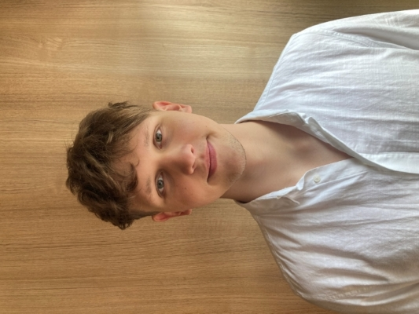

# **Tõnis Pütsepp**  

  

## **Miks ma tulin õppima Haapsalu kolledžisse**   
- Tulin õppima Haapsalu just asukoha pärast. Logiliselt lähedal Tallinnale ja koht on rahulik.
- Eriala sobis kuna tegemist on rohkem praktilisema õppega, mis on hajutatud väga mõistlikult kuu vältes.
- Lisaks sellele kõigele on see tore väljakutse teha midagi väljaspool igavat argielu ja harida ennast selle käigus.